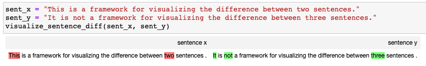

# Visualize Sentence Diff

A python library to visualize differences between two sentences.

## Install

```sh
pip install visualize_sentence_diff
```

## Example

The differences between two sentences are detected by `difflib.Differ`.
The outputs are visualized by `IPython.display`.

Pleaes refer to `test` directory for more example.


